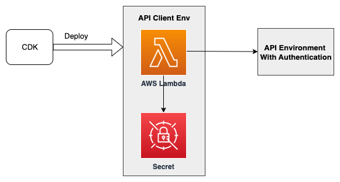

# Overview


This code implement a process using Lambda function and headless browsers to automatically login OIDC IdP, retrieve cookies and invoke API. You can use CDK to build AWS Resources and python code for Lambda function.

# User Guide

After cloning the code, execute the following CDK command to deploy the environment:
```
cdk deploy --parameters ServerUrl="https://<Server URL>" --parameters UserInfoSecretManagerName="<User Secret Arn>" --parameters CookieSecretManagerName="<Cookie Secret Name>"
```

 - Server URL: API endpoint, for example: https://example.com
 - User Secret Name: The name of secret
 	it need to be created manually in Amazon Secret Manager and store the OIDC IdP user’s credential, like below:
 	{
	    "username":"<username>",
	    "password":"<password>"
	}
 - Cookie Secret Name: Specify the Secret name to save the cookie. In the code example, we store the obtained cookie to the Secret Manager and need to specify a secret name. The lambda function will create secret by this name.

 After the CDK deploy successfully, you will get the API client environment, the architecture as below: 

 


